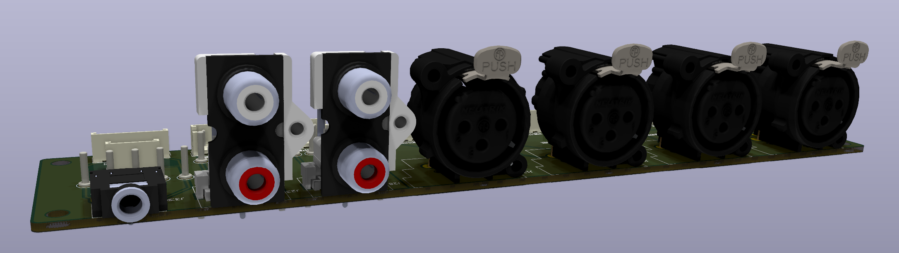
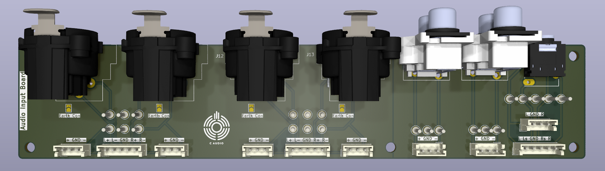

# Audio Input Board

A simple input board to interface multiple connectors with DIY projects. I use it mainly as connector boards for prototype tube amps, which are wired point to point. Adding flimsy cables with connectors solderes to them was and would be tedious. 
Also this makes it possible to securely attach oscilloscope probes on the solder holes.

## Connectors on the board are:
1. 3.5mm Stereo Jack
2. 2 Stereo Chinch/RCA connectors (for input/output)
3. 4 Mono Differential XLR connectors (for input/output). One could use each of these as a single stereo Jack 

To interface these connectors to your DIY project you need a few JST_EH P2.50mm connectors and cables, which are the (it looks like to me) standard for cheap knock off DIY connectors in sets on eBay. 

You could also just solder wires to the holes corresponding to the input jack.

The XLR connectors wre wired somewhat weirdly, like oyu can see in the next picture:

As you can see, the top pins are the hot pins and the bottom pins are the cold pins. Use this as you like. The pin 1 of the XLR (used for ground or Earth) is connected only to the GND plane on the XLR side. To connect this to the GND of the single ended Jacks (RCA and 3.5mm) you have to solder the little "Earth_Con" jumper. 

The switched contacts of the 3.5mm jack are broken out, too.

## TODOs
- Maybe adding a 4.4mm Pentaconn Jack. These get more and more common on balanced audio amplifiers.
- Improve the marking on the pins to not always having to reference this site... 
- Add outputs too. E.G. a 6.3mm Jack.